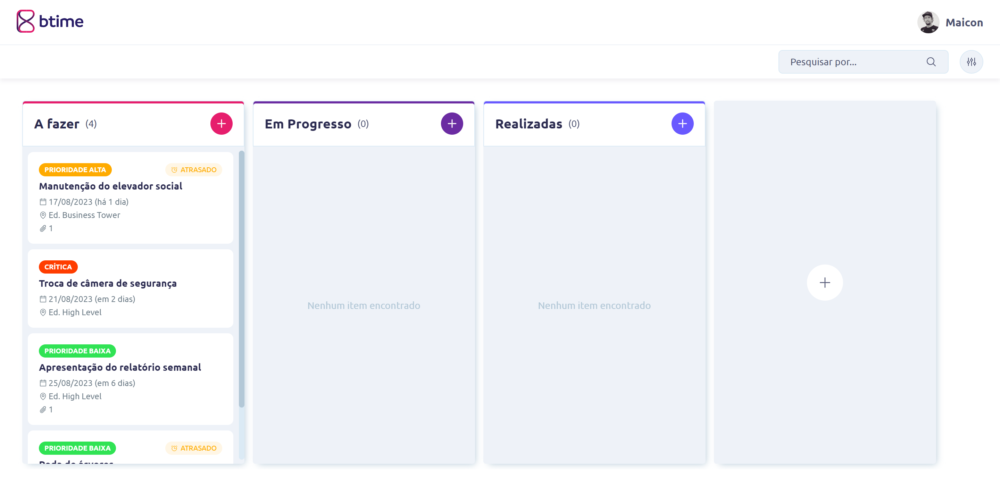

<h1 align="center">
  
</h1>



# 💻 Projeto
> Projeto proposto como desafio para um processo seletivo como Desenvolvedor React.


## ℹ️ Como Executar?

> Clone o Repositório:

```bash
git clone https://github.com/maicondelbel/btime-frontend.git
```

> Entre na pasta do projeto:

```bash
cd btime-frontend
```

> Instale as dependências:

```bash
npm install
```

> Execute o JSON Server:

```bash
npm run dev:server
```

> Em outro terminal e na pasta do projeto, inicie-o:

```bash
npm run dev
```

> ➡️ Acesse [http://localhost:5173](http://localhost:5173) para abrir a aplicação web.

> ➡️ Para alterar o tempo de resposta da API, altere o script de execução do JSON Server no arquivo ```package.json```.
Por padrão está definido em 1000ms.

## 🚀 Tecnologias Utilizadas

- [React](https://react.dev/)
- [Vite](https://vitejs.dev/)
- [Typescript](https://www.typescriptlang.org/)
- [Axios](https://axios-http.com/ptbr/docs/intro)
- [date-fns](https://date-fns.org/)
- [JSON Server](https://github.com/typicode/json-server)

---
<p align="center">Coded by Maicon P. Del Bel</p>